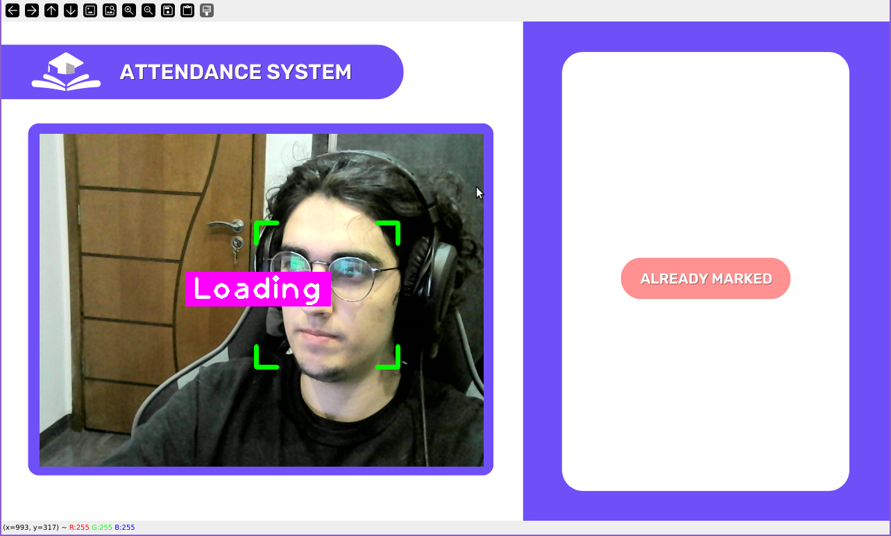

# Facial Recognition College Attendance System (FRCA)

A simple facial recognition program developed in Python using the libraries: pickles, facial_recognition, OpenCV, os, numpy, cvzone, datetime and firebase.

Base on the following sources: [Face Recognition with Real Time](https://www.youtube.com/watch?v=iBomaK2ARyI) | [Asyncio in Python](https://www.youtube.com/watch?v=Qb9s3UiMSTA) | [Gradle Tutorial](https://www.youtube.com/watch?v=gKPMKRnnbXU)
